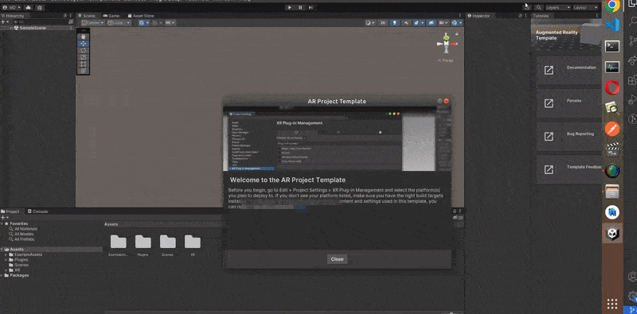
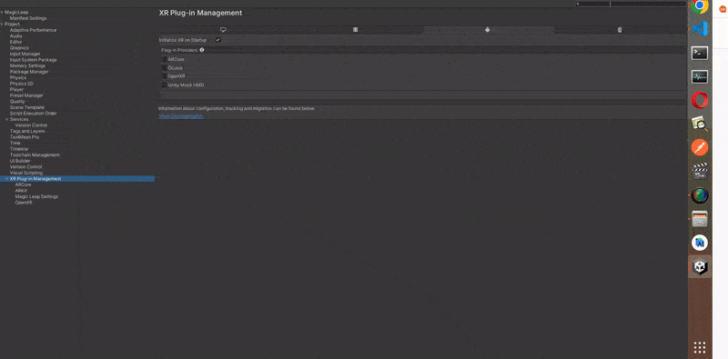
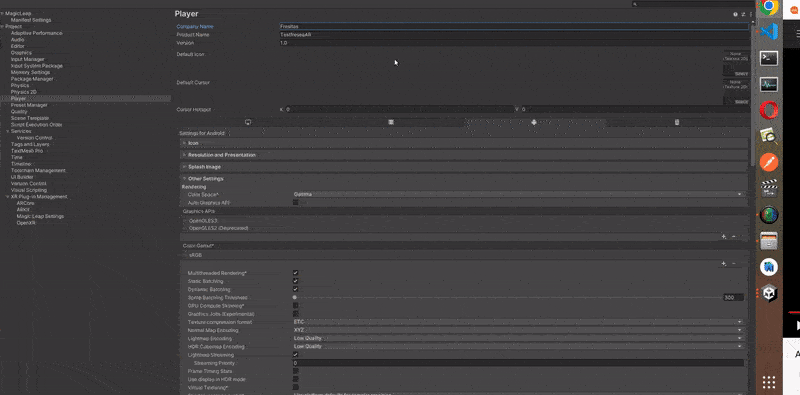

#### [Install Unity 2022 on Mac, Windows or Linux](https://www.youtube.com/watch?v=xgRNdGuDRbw)

> 🔴 I decided to remove Unity and install it again to see if I was doing something wrong. **At the moment** I'm testing unity 2022, contains few new features and I am in the process to see if its easier.

<br>

### How to get started with UNITY

- To avoid any trouble **create an account** and choose <u>individual</u> **if you are not a student**

<br>

#### Install the Unity Hub

<br>

> You need this first, so that you can install the unity packages 👾

<br>

<br>

- Download the [ Unity Hub](https://unity3d.com/get-unity/download)

<br>

- click on **Download UNity Hub**

<br>

- ✋Choose a Directory (where you want the file you are going to download, to be stored)

<br>

- Right click on the directory (ex: a folder called "all-my-unity-stuff" )

<br>

- Once the terminal is open and you see that the file **UnityHub.AppImage** is there (after you downloaded it)

<br>

#### Open the file you downloaded

<br>

- Type the following in your console **chmod +x UnityHub.AppImage** ( 🔴 remember that you have to open the terminal inside the folder that contains the App.image file)

> Read More [Installing the Unity Hub](https://docs.unity3d.com/es/2019.4/Manual/GettingStartedInstallingHub.html)

<br>

> The [chmod (short for change mode)](https://cets.seas.upenn.edu/answers/chmod.html) command is used to manage file system access permissions on Unix and Unix-like systems. There are three basic file system permissions, or modes, to files and directories... [How to Change Directory Permissions in Linux for the Group Owners and Others](https://www.pluralsight.com/blog/it-ops/linux-file-permissions)

<br>

- 🌈 Once you type the command **chmod +x UnityHub.AppImage**, go to the folder you stored the **UnityHub.AppImage**, and double click on it, it will launch the Unity dashboard

<br>
<br>

#### Install the UNITY Editor

- The editor is Unity, here you will choose the version of unity you want to use

<br>
<br>

---

<br>
<br>

### Add a License 👍

> You need this, so check the mn 11:34 of the video below:

##### [How to install Unity 2020 on a Ubuntu Linux - Step by Step guide - .Net SDK + Mono + VS Code](https://www.youtube.com/watch?v=ACo03HTwGiU)

<br>
<br>

---

<br>
<br>

#### Download/Install a version

check the mn 4:14 of the video below:

#### [Install Unity 2022 on Mac, Windows or Linux](https://www.youtube.com/watch?v=xgRNdGuDRbw)

> Read all the options (because it can cause issues if you are missing modules)

<br>

- Once you choose the version you want to use, it will take some time to load

<br>
<br>

---

<br>
<br>

# 🌈

### Start a project

- In your UNITY editor

<br>

- click on the tab **projects** , click **NEW** (at the right side of button, you will have an arrow, choose the unity version you want to use for the new project template you are going to start)

- Once you do that it will prepare all you need for the project, once it s done you will see a dark window

<br>

- Now go to the **File** , select **Build Settings**, choose **android**, now click on **Player Settings**

<br>

- Once you open the **Player settings window** , scroll down to the **XR Plug-in Management** , enable **ARCore** (at the right side of the window)

[]()

<br>

- Now click on **ARCore** , be sure its set like this:

> **Requirement: Required** , **Depth: Required** , Ignore Gradle Version **unchecked**

<br>

[]()

<br>

<!--


##### Basic set up

- I will explain later

[]()

<br>
<br>

#### Package Manager

- Go to **window** and click on package manager

<br>
<br>

---

<br>
<br>

#### The image tracker

```javascript
// DEFAULT
//
using System.Collections;
using System.Collections.Generic;
using UnityEngine;

public class PlaceTrackImage : MonoBehaviour
{
    // Start is called before the first frame update
    void Start()
    {

    }

    // Update is called once per frame
    void Update()
    {

    }
}


```


 -->
