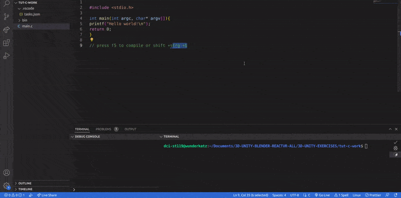

## Install Build Essential

#### [What is build-essential Ubuntu, how to install and use it?](https://linuxhint.com/install-build-essential-ubuntu/#:~:text=The%20build%2Dessentials%20packages%20are,required%20to%20compile%20a%20program.)

> The build-essentials packages are meta-packages that are necessary for compiling software. They include the GNU debugger, g++/GNU compiler collection, and some more **tools and libraries that are required to compile a program. For example, if you need to work on a C/C++ compiler, you need to install essential meta-packages on your system before starting the C compiler installation**. When installing the build-essential packages, some other packages such as G++, dpkg-dev, GCC and make, etc. also install on your system.

<br>

##### INstall it

```javascript
sudo apt install build-essential

```

<br>

- Since I already have it, I got this:

```javascript
Reading package lists... Done
Building dependency tree
Reading state information... Done
build-essential is already the newest version (12.4ubuntu1).
0 upgraded, 0 newly installed, 0 to remove and 85 not upgraded.
```

https://itsfoss.com/build-essential-ubuntu/

<br>
<br>

### Testing project

#### [Visual Studio Code for C/C++ on Linux (2021)](https://www.youtube.com/watch?v=9pjBseGfEPU&t=31s)

<br>
<br>

#### Create a workspace

- Create a new folder, inside the folder create a new file, call it **main.c**

- Now press **strg + shift + b** to compile, but at this point it doesn't know in what language we want to compile, therefore its going to give you 2 options, click on the settings symbol of one of the 2 options, it will generate the code below:

<br>

```javascript
{
  "version": "2.0.0",
  "tasks": [
    {
      "type": "cppbuild",
      "label": "C/C++: gcc build active file",
      "command": "/usr/bin/gcc",
      "args": [
        "-fdiagnostics-color=always",
        "-g", //to debug
        "${file}", //this makes reference to the main.c that we are working now
        "-o", // Output -0, makes reference to the {fileDirname}/${fileBasenameNoExtension}, its basically this ${file}, but without the extension
        "${fileDirname}/${fileBasenameNoExtension}"
      ],
      "options": {
        "cwd": "${fileDirname}"
      },
      "problemMatcher": ["$gcc"],
      "group": "build",
      "detail": "compiler: /usr/bin/gcc"
    }
  ]
}

```

<br>

### The code above is what tells it in which language should compile, but lets change and add some things

<br>

> }/bin/ , **add the bin folder** so that we dont have all the executables in the same folder as the source files:

<br>

```html
${ fileDirname }/bin/${fileBasenameNoExtension}
```

<br>

- right click in the root of the project and create the **bin**

<br>
<br>

- Go to the **group** , and replace it with what you will see here below

```javascript
   ✋   "group": {
          "isDefault": true,
          "kind": "build"
      }
```

##### (notice the changes), this part is what will help us to compile

<br>

```javascript
{
  "version": "2.0.0",
  "tasks": [
    {
      "type": "cppbuild",
      "label": "C/C++: gcc build active file",
      "command": "/usr/bin/gcc",
      "args": [
     "-fdiagnostics-color=always",
        "-g",
        "${file}",
        "-o",
        "${fileDirname}/bin/${fileBasenameNoExtension}"
      ],
      "options": {
        "cwd": "${fileDirname}"
      },
      "problemMatcher": ["$gcc"],
   ✋   "group": {
          "isDefault": true,
          "kind": "build"
      }
    }
  ]
}

```

<br>

## To compile

- Press f5 or strg +shift + b

- check the setting symbol at the right side of the window, so to get the option (gdb launch)

```javascript
{
  "configurations": [
    {
      "name": "(gdb) Launch",
      "type": "cppdbg",
      "request": "launch",
      "program": "${fileDirname}/bin/${fileBasenameNoExtension}",
      "args": [],
      "stopAtEntry": false,
      "cwd": "${fileDirname}",
      "environment": [],
      "externalConsole": false,
      "MIMode": "gdb",
      "setupCommands": [
        {
          "description": "Enable pretty-printing for gdb",
          "text": "-enable-pretty-printing",
          "ignoreFailures": true
        },
        {
          "description": "Set Disassembly Flavor to Intel",
          "text": "-gdb-set disassembly-flavor intel",
          "ignoreFailures": true
        }
      ],
      "preLaunchTask": "C/C++: gcc build active file"
    }
  ],
  "version": "2.0.0"
}


```

<br>

#### I will be adding comments later, as I just wanted to have an idea of how C compiler works

[]()
