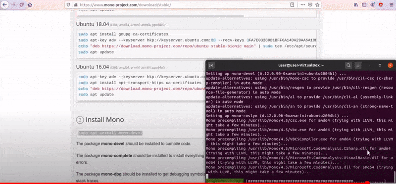
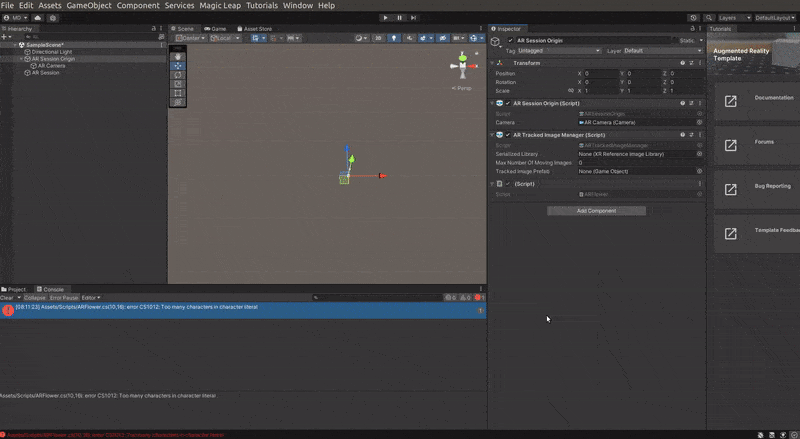

## Integrate visual Studio Code to Unity

- 🔴 After installing step **1\_\_sdk_dotnet-installation.md**) and **2\_\_MONO-installation.md** , you can continue with this

<br>
<br>

#### Go to <u>Preferences</u> inside your unity project ✋

- then click on **external tools**

> I want to browse for out visual studio code in our computer, but since I don't know where its I have to open the terminal

<br>

#### To locate it on the disk, type the following:

```javascript
which code
```

#### result

```javascript
/snap/bin/code //it will depend
```

<br>

#### Go back to unity 🥭

- Now browse visual studio code **based in what you got** on the console (the code above for example/ keep in mind that yours might be different)

<br>

[](https://www.youtube.com/watch?v=ACo03HTwGiU&ab_channel=UnityFromScratch)

<br>

<br>

## Test it, add a SCRIPT 🍭

<br>

- I created a new folder for the scripts, for now ignore the flower image and the little icon in blue, as they belong to another test, SO just care about the Script component that you see I create

<br>

- To go there click on the **Ar Session Origin**, there you will have the option to add another component (by default you will have many components but you can delete them for this test, watch the second video below to see it), anyway just leave the **Ar Session Origin** and under it click **add component**, scroll down and click on **scripts**

<br>

once the script component created, you can open it by clicking it twice (in the path), it will launch Visual studio

<br>

- I got an error (too many characters inside the literals, so I reduced the text to just **hello** and it worked)

<br>

[](https://www.youtube.com/watch?v=ACo03HTwGiU&ab_channel=UnityFromScratch)

<br>

### SO it worked !!! 🤸

- Now i can write the script directly

<br>

<br>
<br>

### To make it work watch this 2 videos

#### [How to install Unity 2020 on a Ubuntu Linux - Step by Step guide - .Net SDK + Mono + VS Code](https://www.youtube.com/watch?v=ACo03HTwGiU&ab_channel=UnityFromScratch)

#### [Augmented Reality (AR) tutorial for beginners using Unity 2022](https://youtu.be/gpaq5bAjya8)
