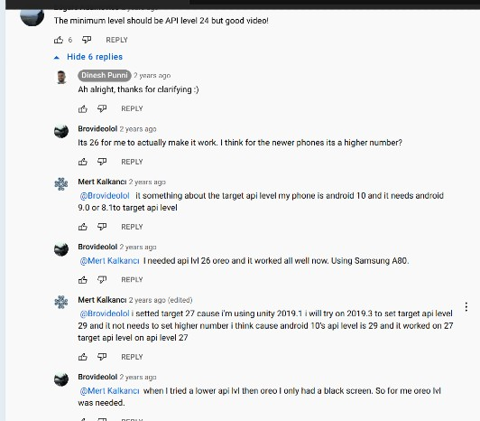

# AR Foundation & Unity 01: Setup for Android 🌞

<br>

#### Check the following

- Install this before you continue with **AR FOUNDATION** ✋

<br>

##### [0 Unity-linux-installation](./0__Unity-linux-installation.md)

##### [1 sdk_dotnet-installation.md](./1__sdk_dotnet-installation.md)

##### [2\_\_MONO-installation.md](./2__MONO-installation.md)

##### [3\_\_C_compiler-installation.md](3__C_compiler-installation.md)

##### [4\_\_integrate-VS-toUnity.md](4__integrate-VS-toUnity.md)

<br>
 
<!-- - CRedits: [AR foundation 01: setup for android](https://youtu.be/0mpsiO2lCx0) by **Dinesh Punni** -->

<br>

#### AR Foundation is a framework purpose-built for augmented reality development that allows you to build rich experiences once, then deploy across multiple mobile and wearable AR devices.

 <br>

#### Branches ✋

#### 001 [setUp | installation of the packages ](https://github.com/nadiamariduena/ar-foundation-and-unity-01_setup-for-Android/tree/0-setup-installation-pachages) 🔴

<br>

> 👾 Once you are done with the installation and the basic set up (choosing the version of UNity you want to work, setting up the plugins for the scene) , you are ready to continue with the steps above 👾

<br>

<br>
<br>

---

<br>
<br>

## Switch to Android

- Go to **File**, then **Build settings**

- choose android and click on switch

 <br>

[]()

<br>

### Player Settings

<br>

- (Every project contains its own settings, so it can vary depending of the project and the version you are using) ... for example if you are watching atutorial from 2020 or 2019, some of these settings contain a setup that is implemented depending if android can handle it, for example in the tutorial [I am watching](https://youtu.be/0mpsiO2lCx0), he advise that we shouldn't **enable** the **Multithreaded rendering** and that is because android doesn't support it yet (I will see if I get some errors if I enable it)

<br>

#### Multithreaded Rendering

<br>

> **Building for Android**
> When building for Android, the Multithreaded Rendering option is supported in ARCore SDK for Unity 1.17.0 or later. However, when this option is enabled in Unity 2018.1 and earlier, using the front-facing (selfie) camera is not supported. [Read more](https://developers.google.com/ar/develop/unity/mt-rendering)

<br>

### AR Plugins

<br>

> 👍Looking for the **AR plugins** was a bit confusing because the tutorial I am watching is from unity 2019 I think, so the dashboard is different, but at the end I could find it.

<br>

> When i click on the white circle(as you can see on the img) I am updating the version of that specific plugin, you can do the same for all the plugins that contain that white circle.

<br>

- Once you open the plugins dashboard, go to the top-left of the window, and click on the **arrow** to unfold the options, then click on the **Unity Registry**

<br>

#### Unity Registry

<br>

- When you click on the **Unity Registry**, you will have a bigger array of options, there you will find the **AR** related plugins

- Notice that when you click on the AR (at the right-bottom) you will see an option to **install**, click on it to install it

<br>

##### For this tutorial I will need the AR Foundation, AR substance systems (which I dont see in this unity version), also I will eed to enable one of the following:

<br>

- ARCore XR Plugin ✋

or

- ARKit XR Plugin ✋

##### All depends of what we are going to need, but here we will use the ARCore XR Plugin

<br>

---

<br>
<br>

## Setting up the scene 🥭

- Here I will add basic elements such as: lights, object etc and the **AR camera and AR Session**

<br>

> **The AR Session controls the lifecycle of an AR experience** by enabling or disabling AR on the target platform. The ARSession can be on any GameObject

<br>

##### Right click on the left bar to open the menu, add a cube, then a pointlight

[]()

<br>
<br>

## Phone

#### ✋ Now that I have the basic to test, lets continue with the phone setup:

<br>

- Go to your phone **settings > about phone**, then scroll down and look for the **build number** (hit it several times, until a message shows, it will tell you that you have enabled the **developer** mode)

<br>

- At this point you will have the developer options, but if you don't see it, go back to the settings and inside the search bar type **developer options**

<br>
<br>

## Developer options 👾

<br>

- go to the **USB debugging** and **enable** it

<br>

- **connect the usb** cable to your computer

<br>

- Once connected, it will detect your device, it will ask you to accept the connection to your computer, then you will see a menu **USB Preferences** , choose **File Transfer**

<br>

- 🔴 go to your notification and click on the android one, this one will ask you if you want to **Allow USB debugging?** , click **allow**

<br>

<br>

- Now go to unity, **file** > **build on settings**, create a folder and call it **Builds**, be sure that its showing you the file type **apk** (when my phone wasnt connected it didnt show me anything), now its working and it can start building

<br>

#### Errors when building 🔴

- **1** Errors after installing the sdk,dotnet etc

<br>

> Now I no longer have errors related to sdk,dotnet etc that prevented me of building anything, what I have now is a black screen on my phone, it s receiving the unity scene but something is wrong, so to know more about the **error** , I have to go to the console in Unity and read what the error is about:

<br>

[No active UnityEngine.XR.ARSubsystems.XRDepthSubsystem is available.](https://forum.unity.com/threads/no-active-unityengine-xr-arsubsystems-xrdepthsubsystem-is-available.1071215/)

```javascript
No active UnityEngine.XR.XRInputSubsystem is available. Please ensure that a valid loader configuration exists in the XR project settings.

```

<br>

#### I am going to downgrade it to see if it works in another 👍 🌈

- SO after a couple of hours of testing, I could make it work in the 2022 version, but even if I got what I wanted, I will continue to test to see the differences

<br>

[]()

<br>

<br>

- **2** Errors I had before installing the SDK, dotnet etc (**check the branches TO FOLLOW THE STEPS, at the top of this file**)

<br>
<br>

<details> <summary>OPEN / Errors before installing sdk, dotnet etc</summary>

> 🔴 I had 2 errors when **building**, one was related to the **Player Settings**, I didnt notice they were back to default, so I had to repeat the process (disabling the Multithreaded Rendering, all the other steps I mentioned before, also disabling the vulkan option that i forgot to mention, you have to scroll on top , still on the **Other Settings tab**, there you will see the Vulkan and the OpenGLES3, click on the vulkan and press minus to remove it)

<br>

[]()

- The second error

#### 🔴 I am having the same issue the people on the comments are talking about, so I must to see if I can solve it

<br>

- After I enabled the **ARCore** inside the Player settings, i got the message below, but it took a little more time to load and nearly freezed my laptop

> Manifest merger failed with multiple errors; see logs

<br>

##### To keep in mind

[]()

<br>
<br>

#### I will try again, now i will check this warning

[]()

### Gradle version 5.6.4 (5.1.1 detected)

> In order to install Gradle you need Java in your system:

<br>

- for windows [How to Fix Gradle build failed Unity
  ](https://www.youtube.com/watch?v=DBg8ltfKGSA&list=LL&index=1&ab_channel=CodeProf)

  <br>
  <br>

  # 👾

#### This one work for me but before installing Gradle you have to install JAVA

<br>

##### 1. Install java /JDK [How To Install Oracle Java (JDK) On Ubuntu 20.04 LTS, Debian Linux](https://youtu.be/ogWKP9Lm-Qo)

- [Error:could not create the Java Virtual Machine Error:A fatal exception has occured.Program will exit](https://stackoverflow.com/questions/37186197/errorcould-not-create-the-java-virtual-machine-errora-fatal-exception-has-occu)

<br>
<br>

##### 2. [How to Install Gradle on Ubuntu 20 04 | How to Install Gradle v7.0 Latest on Ubuntu 20.04 LTS](https://www.youtube.com/watch?v=CWV0gE2nDNA&ab_channel=DevOpsHint)

- follow the instructions in the video above [downloading Gradle!](https://gradle.org/next-steps/?version=7.4.2&format=bin)

> https://gradle.org/releases/

<br>

<br>

### Why Gradle?

> ##### Caution: This page documents the ARCore SDK for Unity, which is deprecated, and no longer supported in Unity 2020 and later. This SDK should only be used by developers working on existing projects which are unable to migrate to Unity's AR Foundation.

Key Point: Developers starting new projects should instead use the ARCore Extensions for AR Foundation and refer to the latest documentation.

##### Read more here: [the warning ](https://developers.google.com/ar/develop/unity/android-11-build)

</details>

<br>
<br>

---

<br>
<br>

#### I am testing a couple of things related to unity and android before finishing this project

> As I am still not sure if all the issues are related to the SDK or new/old versions etc... so it will be a long night again
