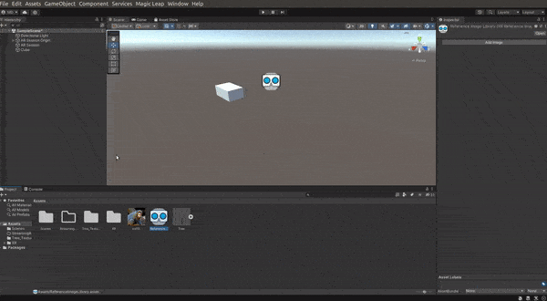

### AR[ Image Tracking](https://youtu.be/o_z_Eb8Yh2g) 🍭

<br>

- Once you have the setup from [step 6 ](./6__AR-foundation.md)

<br>

- You can proceed to add a component, this component will handle the image.

<br>

- **TO START**, click on the **AR Session Origin** , once you click on that go to the right side of the window, there click on **add component**, then click on **Ar tracked image Manager** (if you dont find it in the menu, type it)

<br>

[]()

<br>

[]()

<br>

#### For this component, we will need an XR reference

- go to your project, right click to open the menu

<br>

- create > XR > Reference image library

<br>

[]()

<br>

[]()

<br>
<br>

#### Drag and drop the image to the workspace, then take the image from the workspace and drag it to the component on top (there is a little icon where the image should be)

[]()

<br>

#### Specify the size of the image 🌞

<br>

- Here you will specify the size of the image in **meters** , so add something like 30 cm (0.3)

<br>

- **Keep Texture at Runtime** , if you enable this it means that the texture will be available when you press **play**, otherwise the texture will not be on the **player**

<br>

> SO when you are on your phone, you can still exit the picture, but this is going to blow up your phone and the size of your application if you have a **bunch of images stored there**, so you should only keep it if you really need it ( 🔴 not sure of this advise, but with time I will be returning here to explain it better)

<br>

- 🌵 Add other images and give the images names

<br>

[]()

<br>

#### Now I need to reference the image I just created 🍭

- Drag and drop the reference into the tracked image component, once you do that its going to be detected, but I will need to write a little script

<br>

[]()

<br>

## [Create the Script](https://youtu.be/o_z_Eb8Yh2g?t=286) 🌻

- Once you create the script file, double click on it to open the **visual studio code** , if it doesn't work its because you don't have it yet, so follow this steps to install it: [install VS](./4__integrate-VS-toUnity.md)

<br>

[]()

<br>
<br>

#### The first thing we are going to do is:

- **add a reference** of our **reference image manager** AR

<br>

- Start by adding this

```javascript
using UnityEngine.XR;
using UnityEngine.XR.ARFoundation;
```

<br>

#### Then add the following functions

> 🔴 If you are new like me in C#, dont worry! I think if you have a bit of experience it will be fine

```javascript
using System.Collections;
using System.Collections.Generic;
using UnityEngine;
// 1
using UnityEngine.XR;
using UnityEngine.XR.ARFoundation;


public class ImageRecognitionExample : MonoBehaviour
{
    // 2
     private ARTrackedImageManager _arTrackedImageManager;

//
// 3
private void Awake()
{
    // 4 this makes reference to the component in unity that contains the reference we dragged and drop (the link to be exact)
    _arTrackedImageManager = FindObjectOfType<ARTrackedImageManager>();
   ;
    //
}
// 5 subscribe when enabled (+)
public void OnEnable()
{
    // here we want to subscribe to the image condition event
   _arTrackedImageManager.trackedImagesChanged += OnImageChanged;
}
//
// 6 unsubscribe when disabled (-)
public void OnDisabled()
{
    // here we want to subscribe to the image condition event
   _arTrackedImageManager.trackedImagesChanged -= OnImageChanged;
}
//
// 7 now write the method (the method is related to the 2 lines of code that we have above) "OnImageChanged"

public void OnImageChanged(ARTrackedImagesChangedEventArgs args)
{
    //8 here we will iterate through the images
 foreach (var trackedImage in args.added)
 {
     Debug.Log(trackedImage.name);
     //like a console log
     /// the name corresponds to the name inside the component where i added the size of the image
 }
}


}

```

<br>
<br>

### Create an object 🌞

<br>

- Once you are done with the SCRIPT above, drag and drop the script file you see in your workspace (together with the images and other stuff), position it under the 2 other components (under the tracking image)

> for demonstration i deleted the object and I created a new one

<br>

[]()

<br>

##### Also drag and drop the cube inside the workspace, then delete the cube that is on the top (close to the directional light)

> Once you have the cube inside the workspace, drag and drop it inside the **tracked image prefab** 🐎

<br>

[]()

<br>

#### Now you can go to the build

[]()

<br>
<br>

##### 🔴 When I tried to build there was an error, and the reason for the error is because I created another image component and I didnt add a image, so it show me an error, the solution is either add an image or just remove the extra component

[]()

<br>

#### Here you can see that it tells you that a texture is missing

[]()

<br>

#### After you remove the extra image component that is causing the error that prevents us <u>to Build the test</u>, you are ready to go

- click **build and run**

<br>

<br>

## 🍰

##### To test if it works...

> ✋ click on the image (in my case is the monkey) , it will open a window with the image, then use your phone in the direction of your computers screen and there you have it.

<br>

[]()

[]()
