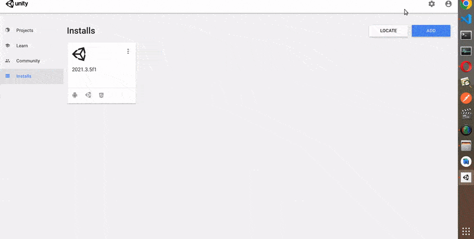
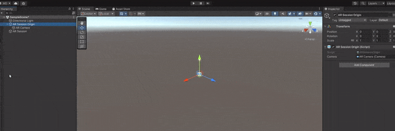
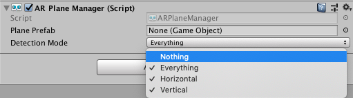
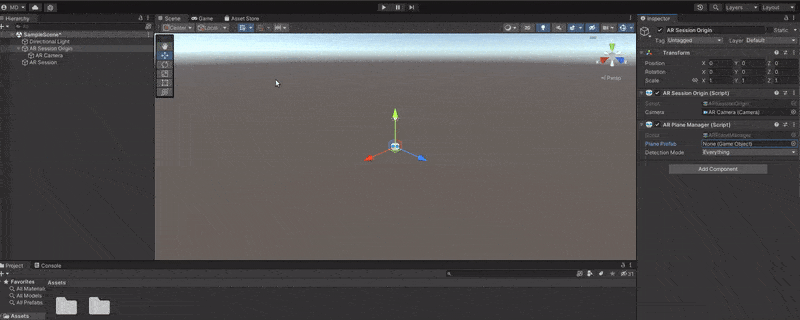
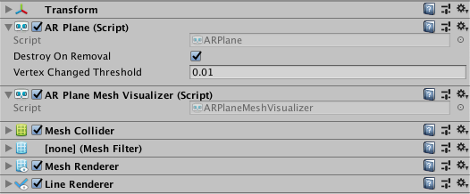
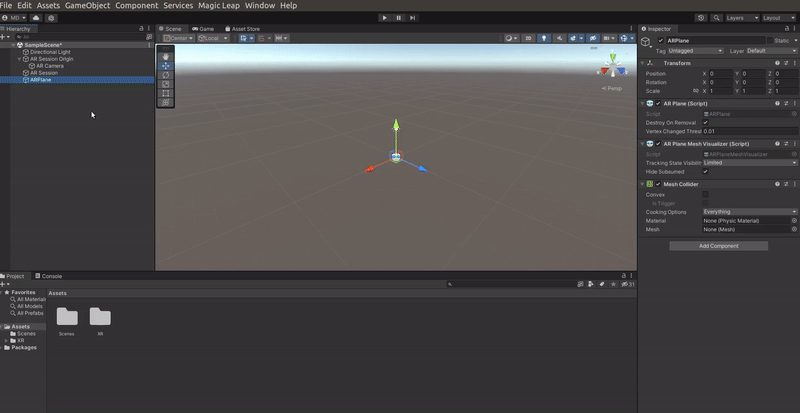

### AR [Plane Detection](https://youtu.be/uWWiYfPTUtU) 🥭

 
 

### Start by creating a new project 🌻

- change the name of the project

- repeat all the steps from ✋ [step 6](./6__AR-foundation.md)

 

 

- After that go to the **Build Settings > PLayer Stetings** and repeat all the steps from ✋ [step 6](./6__AR-foundation.md)

 

### Setting up the scene 🍭

 

- Click on **AR Session Origin** (left side) and under the AR Session Origin component (right side), click on **Add component**, once the dropdown opens choose **AR plane manager**

 

 

### AR plane manager 🍰

> The plane manager creates GameObjects for each detected plane in the environment. A plane is a flat surface represented by a pose, dimensions, and boundary points. The boundary points are convex.

##### Docs: [AR plane manager](https://docs.unity3d.com/Packages/com.unity.xr.arfoundation@4.0/manual/plane-manager.html)

 

> You can specify a detection mode, which can be horizontal, vertical, or both. Some platforms require extra work to perform vertical plane detection, so if you only need horizontal planes, you should disable vertical plane detection.

 

 

### Plane Prefab 🍰

> **When a plane is detected, the AR Plane Manager instantiates the Plane Prefab** to represent the plane. The Plane Prefab can stay null, but the plane manager ensures the instantiated GameObject has an ARPlane component on it. The ARPlane component only contains data about the detected plane.

##### read more: [AR plane manager](https://docs.unity3d.com/Packages/com.unity.xr.arfoundation@4.0/manual/plane-manager.html)

 

### Create the Plane Prefab 🍰

- After creating the Plane manager, you will see that there is a **Plane prefab** required, at the moment in our project we dont have one. ✋ There are some pre build **prefabs** you can use from the **unity samples** (they look like this [minute: 5:18](https://youtu.be/uWWiYfPTUtU?t=318))

 

#### Go to the left side and add the following:

 

- Right click **create an empty** object, rename to ARPlne, then go to the right side and **add component**

- add this 3 components: AR Plane , AR PlaneMesh visualizer, MeshCollider ✋

 

 

#### After that we need to add 2 more components in the same place, as we need a way to visualize our place, so that is going to be:

- A **Mesh Filter**

- and a **Mesh renderer**

 

> When I create the cube to test, you will see that it keeps everything on top of its component

 
