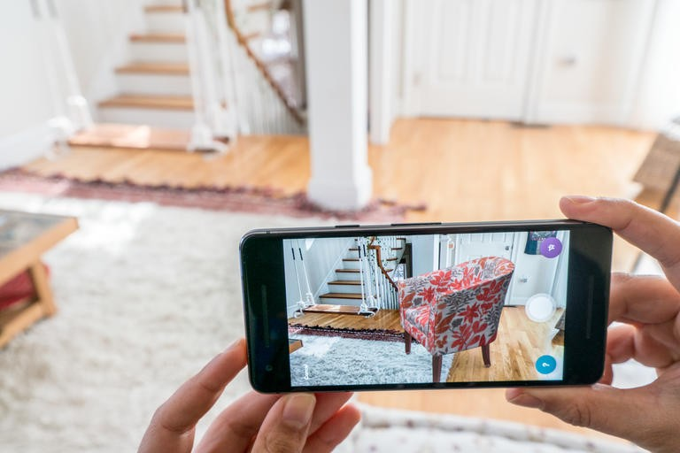
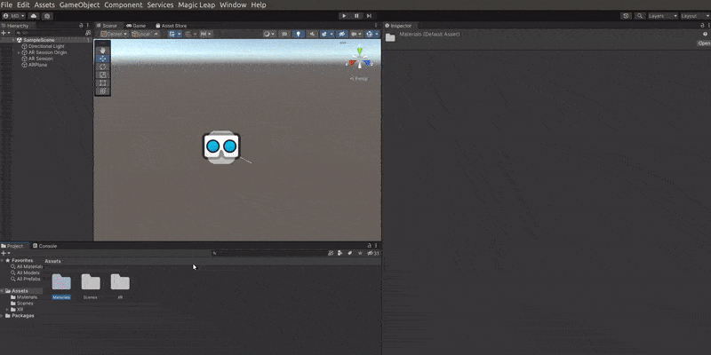
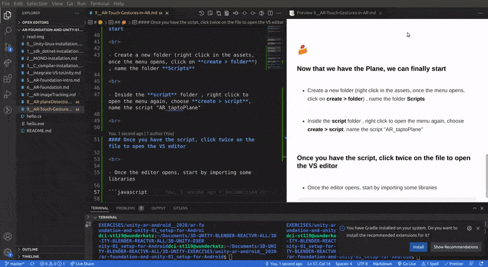

## [Placing and Manipulating Objects in AR](https://youtu.be/xguiSueY1Lw)

##### credits article: [Learn unity.com](https://learn.unity.com/tutorial/placing-and-manipulating-objects-in-ar#)

<br>

[]()

<br>
<br>

---

<br>
<br>

# 🌞

#### Start by setting up the basics

- 1. Follow this steps: [6\_\_AR-foundation](https://github.com/nadiamariduena/ar-foundation-and-unity-01_setup-for-Android/blob/master/6__AR-foundation.md)

<br>

[](https://github.com/nadiamariduena/ar-foundation-and-unity-01_setup-for-Android/blob/master/6__AR-foundation.md)

<br>
<br>

- 2. **Now set up the Plane** settings, follow the steps here: [/8\_\_AR-planeDetection.md](https://github.com/nadiamariduena/ar-foundation-and-unity-01_setup-for-Android/blob/master/8__AR-planeDetection.md)

[](https://github.com/nadiamariduena/ar-foundation-and-unity-01_setup-for-Android/blob/master/8__AR-planeDetection.md)

<br>
<br>

## 🍰

## Now that we have the Plane, we can finally start

<br>

#### 🔴 DONT WORRY about the script, after I am done with the AR basic course, I will continue with [Learn C# for Unity](https://xrbootcamp.com/pre-coding-course/)

<br>

- Create a new folder (right click in the assets, once the menu opens, click on **create > folder**) , name the folder **Scripts**

<br>

- Inside the **script** folder , right click to open the menu again, choose **create > script**, name the script "AR_taptoPlane"

<br>

#### Once you have the script, click twice on the file to open the VS editor

<br>

- Once the editor opens, start by importing some libraries

```javascript
using System.Collections;
using System.Collections.Generic;
using UnityEngine;
using UnityEngine.XR.ARFoundation;  ✋
using UnityEngine.XR.ARSubsystems;  ✋

public class NewBehaviourScript : MonoBehaviour
{
    // Start is called before the first frame update
    void Start()
    {

    }

    // Update is called once per frame
    void Update()
    {

    }
}

```

[]()

<br>
<br>

#### Add the variables

```javascript
   //2 now create some variables
//    first we will start with a pubic variable:    gameObjectToInstantiate
public GameObject gameObjectToInstantiate;
//
// 3 then private variables: spawnedObject
private GameObject spawnedObject;
// 4
private ARRaycastManager _arRaycastManager;
//  5
private Vector2 touchPosition; //the position will be use when we
// will tap on the screen to then detect where we have to shoot our
// raycast and where to place out object
//
// 6 the last thing we need is a reference of our raycast hits, so
// here below we will create a static list of our "raycast hits"  List<ARRaycastHits>
// call it "hits"
//
static List<ARRaycastHits> hits = new  List<ARRaycastHits>();

```

<br>

#### If you know already that there are some components which are required for your component to work,

- you can use the required component field on top of the class so basically like this (look at the top of the class)

```javascript
// 1 import the 2 libraries below( UnityEngine.XR.ARFoundation, UnityEngine.XR.ARSubsystems)
using UnityEngine.XR.ARFoundation;
using UnityEngine.XR.ARSubsystems;


//7  ✋
[RequiredComponent(typeOf(ARRaycastManager ))]
//
//
public class ARTapToPlaceObject : MonoBehaviour{}
```

<br>

> At this point if we added our **ARTapToPlaceObject** from above, on to any game **object**, it will automatically add this one as well **<u>ARRaycastManager</u>** , then we can just use it free without just checking if we have the object because we know we have this component **<u>ARRaycastManager</u>** as well.

<br>
<br>

#### We can now get rid of our Start() function, and instead an awake() function

```javascript
//
//
// 👍 delete the below
void Start();
{
}
```

<br>
<br>

#### Add this instead

```javascript
//
   private void Awake()
   {
    // ✋   Here we are going to reference our raycasting
   }
```

<br>

#### add this inside the above function

- Here we are going to reference our raycasting

```javascript


    //    ✋
       _arRaycastManager = GetComponent<ARRaycastManager>();


```

<br>

#### we are free to use the line above, because we added this component on the top of the class

```javascript
//7  ✋
[RequiredComponent(typeOf(ARRaycastManager))];
```

<br>
<br>

#### 🔴 DONT WORRY about the script, after I am done with the AR basic course, I will continue with [Learn C# for Unity](https://xrbootcamp.com/pre-coding-course/)

<br>
<br>

#### Now we will handle the conditional for the touch events
