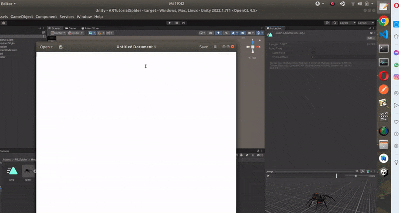
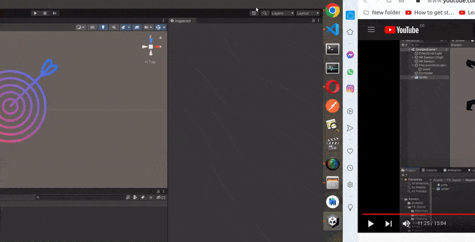
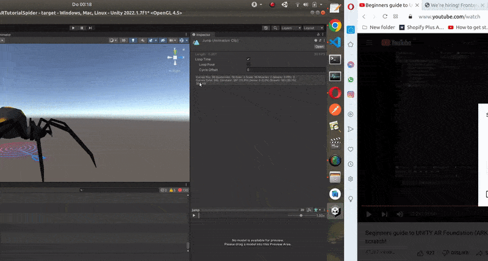
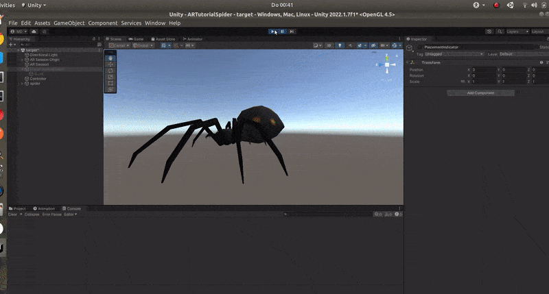
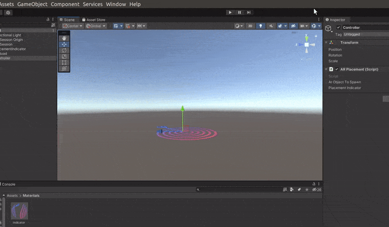
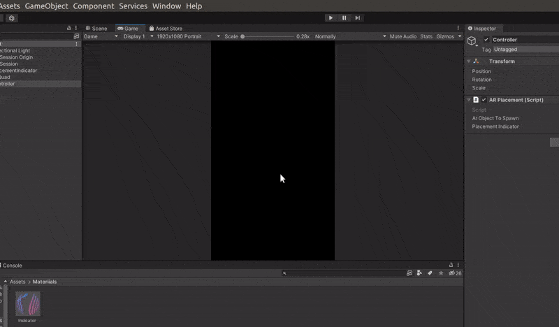

# 🍨

## [Beginners guide to UNITY AR Foundation (ARKit & ARCore) - Build your first AR app from scratch!](https://youtu.be/KqzlGApWPEA)

<br>

- Start by creating a new **3D** project, then once its created we will see that we have the basic set up(we dont have yet the XR "packages"), so at this point we just have the **Main Camera and the Directional Light**

<br>
<br>

### Start by importing the XR packages 🌈

<br>

- Go to **window** > **package manager**

<br>

- Click on the arrow on the top of the window, then once the dropdown unfolds, click on the **Unity registry**, you can either install all the AR packages related, or you can also avoid unfolding the menu and just scroll down to do it one by one. **LOOK FOR** ARCore XR Plugin, and install it, repeat the same steps with the ARFoundation and the ARKit XR Plugin

<br>

- The tutorial was created a year ago so the version he is using are different **(3.1.8)**, right now I will be using the **(4.2.3)**

<br>

> 🔴 I will try this tutorial with this new version to see if it works, if it doesn't work I will try to downgrade few versions.

<br>

- ✋ After installing the packages you will notice the **XR folder** has been creating and is now in your unity dashboard

<br>

- ✋ Delete the default camera, as we will be using the XR main camera

<br>

- ✋ Add the <u>AR Session Origin</u> **(it contains the AR camera)**

<br>

## Now we need an indicator

- This indicator will help us see where do we spawn our **Game object**

<br>

- ✋ Create an **EMPTY Game object**, right click under the **AR Session** (click on the dark space), once you right click on it and the menu unfolds, choose **Create Empty**

<br>

- ✋ Once the empty has been created, change the empty name from GameObject to **PlacementIndicator**

<br>

[]()

<br>
<br>

> 🍨 Now that we have changed the name of the **empty**,

<br>

- ✋ **Right click** on the **empty** to unfold the menu, once the **menu opens** choose **3D Object > Quad**

<br>

[]()

<br>

### Rotate the Quad 🍒

- **Go to the right side** of the window (don't forget to click on the quad, OTHERWISE you will not see the options)

### Scale 🍒

- change the scale to 0.3 on the **x y z axis**

<br>

[]()

<br>

<br>

## The script

- ✋ Add another **empty** Object and call it **controller**

<br>

- ✋ Then go under the component where you change the name of the empty, and click on **add component**, there type **ARplacement**, you will not find it in the menu but click on **Script** then once it gives you the option of adding it, click on it (check the zoomed version of the image below)

<br>

[]()

<br>

#### Here I created it a second time just for testing 🍰

[]()

<br>

#### ✋ Now that we have the SCRIPT that will help us to put all the logic, lets check if we have all the _complementary_ scripts we will need in our <u>_AR Session Origin_</u> ✋

<br>

- 🔴 add the **AR Plane and the AR Raycast manager**

<br>

[]()

<br>

#### Start working on the script 🍉 🥭

- This is the basic layout of the script

```javascript
using System.Collections;
using System.Collections.Generic;
using UnityEngine;

public class ARplacement : MonoBehaviour
{
    // Start is called before the first frame update
    void Start()
    {

    }

    // Update is called once per frame
    void Update()
    {

    }
}

```

<br>
<br>

#### Read the steps

```javascript
using System.Collections;
using System.Collections.Generic;
using UnityEngine;
// 5
using UnityEngine.XR.ARFoundation;

public class ARplacement : MonoBehaviour
{

// 1
public GameObject arObjectToSpawn;
// 2
public GameObject placementIndicator;
// 10 related to the method in step 9
private GameObject spawnedObject;

//
// 3
private Pose PlacementPose;
// 4
private ARRaycastManager aRRaycastManager;
// 6
private bool placementPoseIsValid = false;


    //
    //
    // Start is called before the first frame update
    void Start()
    {
        // 7
        aRRaycastManager = FindObjectOfType<ARRaycastManager>();
    }

    // Need to update placement indicator (when moving the phone), (then keep track)of the placement "pose" (position) while moving the phone and spawn the AR object. Now in step 8 we will make a function for each one of these
    void Update()
    {
        // 8 make a function for each one
        UpdatePLacementPose();
        UpdatePlacementIndicator();
    }
    // 9 create the methods linked to the functions in step 8
    //
    //  METHOD :     UpdatePlacementIndicator();
    //
    void UpdatePlacementIndicator()
    {
        //11 after creating the private variable in step 10, create the conditional handling the
        //movement *TRANSFORM:  position, rotation:
        if(spawnedObject == null && placementPoseIsValid)
        {
            // 12
            placementIndicator.SetActive(true);
            // 13
            placementIndicator.transform.SetPositionAndRotation(PlacementPose.position, PlacementPose.rotation)
        }else{
            // 14
            placementIndicator.SetActive(false);
        }
    }
    //15  METHOD :    UpdatePLacementPose();
        void UpdatePLacementPose()
        {
            // 16
            // here we will need to give the position of the placement indicator in the screen center, using the current camera, which is the  AR camera
            //  Vector3(0.5f, 0.5f), makes reference to the 0.5 X and 0.5 Y, which is exactly at the center of the screen
            var screenCenter = Camera.current.ViewportToScreenPoint(new Vector3(0.5f, 0.5f));
            // 17
            // then lets get all the HITS and create a List with the "ARRaycastHit" on it. (in other words, inside the list you will add the ARRaycastHit component)
            var hits = new List<ARRaycastHit>();
            // 18
            // Then using the  ARRaycastManager, Raycast, screenCenter, and the hits, we calculated on the trackable planes
            aRRaycastManager.Raycast(screenCenter, hits, TrackableType.Planes);
            //    so here above we have the aRRaycastManager that we have defined on the top (where the variables are) and then this one is going to use the "raycast" method which then give us a touch position, then it takes the "hits" from our static list in step 17,

            //
            // 19
            // Add a condition, that if the hits dot count is greater than 0, then
            // change the boolean accordingly
            //
            // if the Input.TouchCount is greater than 0 , then we want to get the touchPosition and then return  true, because we are returning a boolean, and if there is nothing (if there is not touchCount) then the touch position stays as default, so if there is not touchCount we are returning false
        touchPosition = Input.GetTouch(index 0).position;
            placementPoseIsValid = hits.Count > 0;
            if(placementPoseIsValid)
            {
                // 20
                // and further check if the placement pose is valid, then get the very first hit and store it in the placement pose
                PlacementPose = hits[0].pose;
                //
//  check step 11            then we have to figure out if there is a "hit" object already, if there is none, then we want to instantiate it (create one) and if there is an object already then we want to basically move it around, it will totally depends on the use case, basically what we want to build in this demo which is also from the ARFoundation samples, is that if there is an object already, then we just wanted to have this one cube to move around, but you can use anything, you can also limit it to 5 objects, here it will totally depends on your demo and whatever you want to build
                //
            }
        }
        // 21
        // to place the ar object, simply store it in the spawn  by using "instantiate", the instantiate stuff inside the paranthesis is calculated in step
        void ARPlaceObject()
        {
            spawnedObject = Instantiate(arObjectToSpawn, PlacementPose.position, PlacementPose.rotation);
        }
        // 22 after this, go back to the update function, and call the ARPlaceObject() function
}

```

<br>

> 🔴 Go to unity and check for errors, if it tells you there is "," or a ";", click twice in the error on the unity console, it will open VS exactly where the error is, and add what its asking. If you get an error like **TrackableType** dont exist, add this **using UnityEngine.XR.ARSubsystems;** on the top of the file where all the libraries are required, he didnt add it on the tutorial because I think the version he is using already has it.

<br>
<br>

#### After step 22:, go back to the update function, and call the ARPlaceObject() function

```javascript
// 23  calling the method ARPlaceObject in the update function (which is here), when there is nothing in the spawnedObject, by nothing i meant not touch
if(spawnedObject == null && placementPoseIsValid && Input.touchCount > 0 && Input.GetTouch(0).phase == TouchPhase.Began){
    //24 calling the function in step 21
    ARPlaceObject();
}


        //
        //
        // 8 make a function for each one
        UpdatePLacementPose();
        UpdatePlacementIndicator();
    }
    // 9 create the methods linked to the functions in step 8
    //
```

<br>
<br>

#### SO this is what we have

```javascript
using System.Collections;
using System.Collections.Generic;
using UnityEngine;
// 5

using UnityEngine.XR.ARFoundation;
using UnityEngine.XR.ARSubsystems;

public class ARplacement : MonoBehaviour
{

// 1
public GameObject arObjectToSpawn;
// 2
public GameObject placementIndicator;
// 10 related to the method in step 9
private GameObject spawnedObject;

//
// 3
private Pose PlacementPose;
// 4
private ARRaycastManager aRRaycastManager;
// 6
private bool placementPoseIsValid = false;


    //
    //
    // Start is called before the first frame update
    void Start()
    {
        // 7
        aRRaycastManager = FindObjectOfType<ARRaycastManager>();
    }

    // Need to update placement indicator (when moving the phone), (then keep track)of the placement "pose" (position) while moving the phone and spawn the AR object. Now in step 8 we will make a function for each one of these
    void Update()
    {


// 23  calling the method ARPlaceObject in the update function (which is here), when there is nothing in the spawnedObject, by nothing i meant not touch
if(spawnedObject == null && placementPoseIsValid && Input.touchCount > 0 && Input.GetTouch(0).phase == TouchPhase.Began){
    //24 calling the function in step 21
    ARPlaceObject();
}


        //
        //
        // 8 make a function for each one
        UpdatePLacementPose();
        UpdatePlacementIndicator();
    }
    // 9 create the methods linked to the functions in step 8
    //
    //  METHOD :     UpdatePlacementIndicator();
    //
    void UpdatePlacementIndicator()
    {
        //11 after creating the private variable in step 10, create the conditional handling the
        //movement *TRANSFORM:  position, rotation:
        if(spawnedObject == null && placementPoseIsValid)
        {
            // 12
            placementIndicator.SetActive(true);
            // 13
            placementIndicator.transform.SetPositionAndRotation(PlacementPose.position, PlacementPose.rotation);
        }else{
            // 14
            placementIndicator.SetActive(false);
        }
    }
    //15  METHOD :    UpdatePLacementPose();
        void UpdatePLacementPose()
        {
            // 16
            // here we will need to give the position of the placement indicator in the screen center, using the current camera, which is the  AR camera
            //  Vector3(0.5f, 0.5f), makes reference to the 0.5 X and 0.5 Y, which is exactly at the center of the screen
            var screenCenter = Camera.current.ViewportToScreenPoint(new Vector3(0.5f, 0.5f));
            // 17
            // then lets get all the HITS and create a List with the "ARRaycastHit" on it. (in other words, inside the list you will add the ARRaycastHit component)
            var hits = new List<ARRaycastHit>();
            // 18
            // Then using the  ARRaycastManager, Raycast, screenCenter, and the hits, we calculated on the trackable planes
            aRRaycastManager.Raycast(screenCenter, hits, TrackableType.Planes);
            //    so here above we have the aRRaycastManager that we have defined on the top (where the variables are) and then this one is going to use the "raycast" method which then give us a touch position, then it takes the "hits" from our static list in step 17,

            //
            // 19
            // Add a condition, that if the hits dot count is greater than 0, then
            // change the boolean accordingly
            //
            // if the Input.TouchCount is greater than 0 , then we want to get the touchPosition and then return  true, because we are returning a boolean, and if there is nothing (if there is not touchCount) then the touch position stays as default, so if there is not touchCount we are returning false

            placementPoseIsValid = hits.Count > 0;
            if(placementPoseIsValid)
            {
                // 20
                // and further check if the placement pose is valid, then get the very first hit and store it in the placement pose
                PlacementPose = hits[0].pose;
                //
//  check step 11  and 23          then we have to figure out if there is a "hit" object already, if there is none, then we want to instantiate it (create one) and if there is an object already then we want to basically move it around, it will totally depends on the use case, basically what we want to build in this demo which is also from the ARFoundation samples, is that if there is an object already, then we just wanted to have this one cube to move around, but you can use anything, you can also limit it to 5 objects, here it will totally depends on your demo and whatever you want to build
                //
            }
        }
        // 21
        // to place the ar object, simply store it in the spawn  by using "instantiate", the instantiate stuff inside the paranthesis is calculated in step
        void ARPlaceObject()
        {
            spawnedObject = Instantiate(arObjectToSpawn, PlacementPose.position, PlacementPose.rotation);
        }
        // 22 after this, go back to the update function, and call the ARPlaceObject() function
}

```

<br>
<br>

#### Go back to unity ☕

> At this point with the code above you shouldn't have any error

<br>

- Go back to unity and put the script file inside the script folder

- ✋ **CREATE** and folder and call it **scripts** (right click inside the dashboard of your assets)

<br>

[]()

<br>
<br>

### Once you add the scripts inside the Scripts folder 🍒

- ✋ Click on the **Controller**, you will notice that now we have 2 empty fields under **AR object To Spawn** and **Placement Indicator**

<br>

- ✋ Grab the **Placement indicator** and drop it inside the corresponding field

<br>

[]()

<br>
<br>

### Add a model from the assets Store 👾

<br>

- ✋ Go to the store and choose a model, I will be using an **fbx** animated spider

<br>

- Once you have your model, go to your assets in the browser and click open in Unity, (if you are already connected in your unity), go to the **window > package manager** click on the top bar dropdown and choose assets, there you will see the assets, click on the one you want and download it, **once it s ready, click on import** (it will open another window, where you will chose what you want to import from the model) click again import it, now go back to your **unity assets** and check the model.

<br>

#### choose model 🍰

[]()

<br>

#### Download model 🧁

[]()

<br>
<br>

## Lets see what the model contains 🍉

- inside of the model you will notice a couple of animations

<br>

[]()

<br>

#### Add an icon to PlacementIndicator

<br>

- go to [flaticon.com](https://www.flaticon.com/)

- Choose a **target** icon, but before downloading it to your unity, create 2 new folders in your assets

<br>

- ✋ CReate 2 new folders, a **Textures** and **Materials**, save the target icon inside the Textures folder(go to your unity project folder inside your comp, look for the one you are working and save it in the Textures)

<br>

- ✋ Now go to the **material folder** , create a new material, change the shader to transparent: **shader > unit > transparent**, once you do that you will have an option to upload or drop the icon

<br>

<br>

> As you can notice, the icon is dark so it doesnt look so nice(just a matter of aesthetic, I dont know how it will appear on dark surfaces) so better to use something with color

[]()

<br>

#### I downloaded another (with color)

<br>

[]()

<br>

#### Now apply the icon

- click on the **PlacementIndicator**, click on the **quad**, drag and drop the **Indicator** material (that is inside the material folder)

<br>

> I thought there was a problem with the icon but since I added 0.3, its very small

[]()

<!-- 10:59

https://youtu.be/KqzlGApWPEA?t=659
-->

<br>

## 🍨

### Get the animation out of the spider

- when you click inside the spider folder or model, you see that it contains a couple of things (animations etc)

<br>

- ✋ **Click** on the **jump** animation of the spider, then **Press command + D** or strg + D

<br>

[]()

<br>

## 🌈

### Now bring the spider to the scene

- change the scale of the spider, from **1 to 0.1 or 0.2** as its too big

<br>

[]()

<br>

## Open the animation tab

<br>

- ✋ go to the **window > Animation**, then click on Animation, a window will appear, grab it and drag it to the bottom of unity window (has to be side by side with the project and console)

<br>

- Once there click on create, **create a new folder** and call it **Animation**, then when it will ask you to **save as**, name it as **Spider**, once you do that you will see that we now have inside the component controller of the spider, the created **Spider**

<br>

[]()

<br>

#### Now do the following to add the animation

- ONce you save it (read the step above)
  , go to the **window > animator**, you will see that another window will open, there you will see something looking like [nodes](https://www.google.com/search?q=nodes+blender&client=opera&hs=27X&source=lnms&tbm=isch&sa=X&ved=2ahUKEwil-PvyhJr5AhWXtKQKHfNJAe0Q_AUoAXoECAEQAw&biw=1251&bih=739&dpr=1.25#imgrc=xZ7naDoK6y7y0M), delete the animation by default, this animations is called **jump**, but before delete it go to your PB_Spider > Models and drag the **jump** animation you find there, inside the window with the **nodes**, once the new **jump** animation is there, delete the default one
  <br>

  - check min: [12:23](https://youtu.be/KqzlGApWPEA?t=743)

[]()

<br>

> 🔴 After adding the jump animation i got this errors

```javascript
NullReferenceException: Object reference not set to an instance of an object
ARPlacement.UpdatePLacementPose () (at Assets/Scripts/ARPlacement.cs:80)
ARPlacement.Update () (at Assets/Scripts/ARPlacement.cs:52)

```

<br>

#### when I click twice on the error to see where is the error coming from, it makes reference to this:

```javascript

            var screenCenter = Camera.current.ViewportToScreenPoint(new Vector3(0.5f, 0.5f));
            // 17
```

<br>

#### ✋ I notice that the error appears, when I click on **play** the animation

<br>

- At this point I dont know if its a big issue, but i will have to solve it if I want to **build it**,

<br>

[]()

<br>

---

<br>

## Create the PREFAB 🌈

- Right click on the **assets**, create a folder, then change the name to **Prefab** , **DRAG** the spider inside the Prefab folder, it will ask you if you want to create a new spider or a variant, for now choose a variant but if your really want to do it like in the video, choose the original, then delete the one under the **controller**

<br>

[]()

<br>

#### Now that you deleted the spider under the controller, lets continue with the export settings

<br>
<br>

## Export settings 🍰

<br>

- If you havent done it already, switch to the **android** platform (**File > Build settings** )

> ✋ then click on the **Player settings** , once it opens this new window , go to **Player**, then check the arrow with the **Other settings**, once there:

- at the top of the window, choose a name, by default you have (Default Company) , but you can change that to whatever you want, for this project i will add **DefaultCompanySpider**

<br>

- change the **Color Space** from Gamma to **Linear**

<br>

- check the **AutoGraphics** , you will have to options there for the graphics API: OpenGLE3 and Vulkan, delete the vulkan by clicking in the minus - (at the right side of the window)

<br>

- Now scroll down in the same window, go to the **Minimum API Level**, choose Android 7.0 Nougat (API level 24)

<br>

[]()

<br>
<br>

#### Close the window and go back to the scene 🌈

<br>

- go to **window > General > Game** once it creates the tab, go to the aspect ratio and choose **1920 x 1080**

<br>

[]()

<br>

### Now that you have the settings above, Go back to the payer settings

<br>

- ✋ **File > Build settings**
  <br>

> ✋ then click on the **Player settings** , once it opens the window , go to **Player**, then check the arrow with the **Resolution and Presentation** tab, once there:

<br>

- Go to the **Default Orientation** , choose **Portrait**, close the window.

<br>

<br>

[]()

<br>

> ##### Don't forget to add the scene, like you see at the end of the gif above

<br>
<br>

#### 🔴 ARCore Plugin

<br>

> ✋ A last thing... check the the **XR Plug-in Management** so that you don't have the black screen issue, when testing it with your phone.

<br>

- (**File > Build settings** )

<br>

> ✋ then click on the **Player settings** , click on the **XR Plug-in Management** then **check** the **ARCore** thats all (in some versions you will have to click on install then you have the option to check on the arcore)

<br>

[]()

<br>

<br>

# 🍨

#### After you have all the set up above, go to the:

- (**File > Build settings** ) and while there click on **Run device** to see if your phone is connected to unity, **if you are not connected**:

<br>

- 🔴 Connect your usb cable to your computer and phone, once it s connected your phone will ask you if you want the connection to be made, and then will ask you for **permission**, once you do that check your unity and click on **refresh**, there you will see your device, now you can click **build and run**

#### Result

- I tried to put the target in the sky but it doesnt work, at the moment there are many things I dont understand, but its already a good thing that the **tap/touch** is working.

[]()
