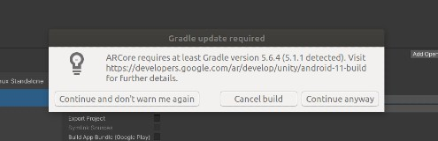

# AR Foundation & Unity 01: Setup for Android 🌞

 

#### Check the following

- Install this before you continue with **AR FOUNDATION** ✋

 

##### [0 Unity-linux-installation](./0__Unity-linux-installation.md)

##### [1 sdk_dotnet-installation.md](./1__sdk_dotnet-installation.md)

##### [2\_\_MONO-installation.md](./2__MONO-installation.md)

##### [3\_\_C_compiler-installation.md](3__C_compiler-installation.md)

##### [4\_\_integrate-VS-toUnity.md](4__integrate-VS-toUnity.md)

 
 
<!-- - CRedits: [AR foundation 01: setup for android](https://youtu.be/0mpsiO2lCx0) by **Dinesh Punni** -->

 

### AR Foundation is a framework purpose-built for augmented reality development that allows you to build rich experiences once, then deploy across multiple mobile and wearable AR devices.

  

## Branches ✋

##### [setUp | installation of the packages ](https://github.com/nadiamariduena/ar-foundation-and-unity-01_setup-for-Android/tree/0-setup-installation-pachages)

 

## Docs

#### [About AR Foundation](https://docs.unity3d.com/Packages/com.unity.xr.arfoundation@4.2/manual/index.html)

 

## Interesting

#### Raycasting

##### [Unity3d with AR Foundation - How To Select AR Objects From Camera Origin Reference Object Position?](https://youtu.be/lkQ1GSJUOJk)

 

##### [Use touch to scale, rotate and drag AR objects | UNITY AR Foundation (ARKit & ARCore) | LeanTween](https://youtu.be/jgQVUttENTI)

 

#### 🥭 Learn C# to continue with the tutorial below:

[Beginners guide to UNITY AR Foundation (ARKit & ARCore) - Build your first AR app from scratch!](https://www.youtube.com/watch?v=KqzlGApWPEA&ab_channel=MohdHamza)

 

> The language that’s used in Unity is called C# (pronounced C-sharp). All the languages that Unity operates with are object-oriented scripting languages. Like any language, scripting languages have syntax, or parts of speech, and the primary parts are called variables, functions, and classes.

 

#### [Is C# The New Javascript Programming Language?](https://youtu.be/m5ArCIMUMfM)

 

### Basics 🌈

#### [C# Tutorial For Beginners & Basics - 1. Installing Visual Studio 2022 & Quick Tips]()

 
 

---

 
 

## Setting up the scene 🥭

- Here I will add basic elements such as: lights, object etc and the **AR camera and AR Session**

> **The AR Session controls the lifecycle of an AR experience** by enabling or disabling AR on the target platform. The ARSession can be on any GameObject

 

- right click on the left bar, to open the menu

 
 

### Before Deploying to the phone

- I need to upload ... , so go to your phone > settings > about phone, then scroll down and look for the **build number** (hit it several times, until a message show, it will tell you that you have enabled the **developer** mode)

 

- At this point you will have the developer options, but if you dont see it, go back to the setting and inside the search bar type **developer options**

 

### Developer options

- go to the **USB debugging** and **enable** it

- connect the usb cable to your computer

- once connected, it will detect your device, it will ask you to acept, then you will see a menu **USB Preferences** , choose **File Transfer**

>

 

- Now go to **file** > **build on settings**, create a folder and call it **Builds**, be sure that its showing you the file type **apk** (when my phone wasnt connected it didnt show me anything), now its working and it can start building

> 🔴 I had 2 errors when **building**, one was related to the **Player Settings**, I didnt notice they were back to default, so I had to repeat the process (disabling the Multithreaded Rendering, all the other steps I mentioned before, also disabling the vulkan option that i forgot to mention, you have to scroll on top , still on the **Other Settings tab**, there you will see the Vulkan and the OpenGLES3, click on the vulkan and press minus to remove it)

 

- The second error

#### 🔴 I am having the same issue the people on the comments are talking about, so I must to see if I can solve it

 

- After I enabled the **ARCore** inside the Player settings, i got the message below, but it took a little more time to load and nearly freezed my laptop

> Manifest merger failed with multiple errors; see logs

 

##### To keep in mind

 
 

#### I will try again, now i will check this warning

### Gradle version 5.6.4 (5.1.1 detected)

> In order to install Gradle you need Java in your system:

 

- for windows [How to Fix Gradle build failed Unity
  ](https://www.youtube.com/watch?v=DBg8ltfKGSA&list=LL&index=1&ab_channel=CodeProf)

   
   

  # 👾

#### This one work for me but before installing Gradle you have to install JAVA

 

##### 1. Install java /JDK [How To Install Oracle Java (JDK) On Ubuntu 20.04 LTS, Debian Linux](https://youtu.be/ogWKP9Lm-Qo)

- [Error:could not create the Java Virtual Machine Error:A fatal exception has occured.Program will exit](https://stackoverflow.com/questions/37186197/errorcould-not-create-the-java-virtual-machine-errora-fatal-exception-has-occu)

 
 

##### 2. [How to Install Gradle on Ubuntu 20 04 | How to Install Gradle v7.0 Latest on Ubuntu 20.04 LTS](https://www.youtube.com/watch?v=CWV0gE2nDNA&ab_channel=DevOpsHint)

- follow the instructions in the video above [downloading Gradle!](https://gradle.org/next-steps/?version=7.4.2&format=bin)

> https://gradle.org/releases/

 

 

### Why Gradle?

> ##### Caution: This page documents the ARCore SDK for Unity, which is deprecated, and no longer supported in Unity 2020 and later. This SDK should only be used by developers working on existing projects which are unable to migrate to Unity's AR Foundation.

Key Point: Developers starting new projects should instead use the ARCore Extensions for AR Foundation and refer to the latest documentation.

##### Read more here: [the warning ](https://developers.google.com/ar/develop/unity/android-11-build)

 
 

---

 
 

#### I am testing a couple of things related to unity and android before finishing this project

> As I am still not sure if all the issues are related to the SDK or new/old versions etc... so it will be a long night again
