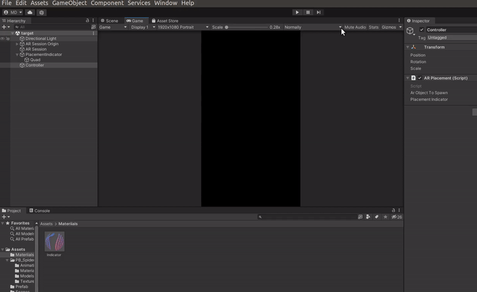
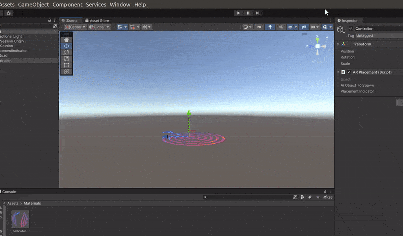
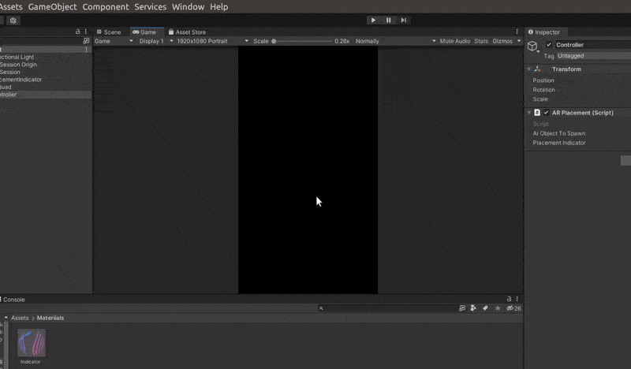
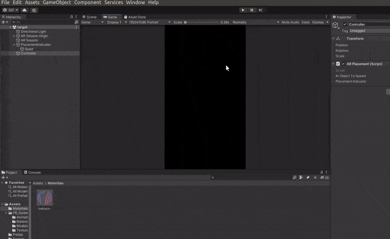

## Export settings 🍰

#### This is the basic you need to build the scene, but not all the projects are the same, so you will need different setting depending on what you are working on.

 

---

 
 
 

### Android 👾

 

- If you haven't done it already, switch to the **android** platform (**File > Build settings** )

 

> ✋ then click on the **Player settings** , once it opens this new window , go to **Player**, then check the arrow with the **Other settings**, once there:

 

- At the top of the window, choose a name, by default you have (Default Company) , but you can change that to whatever you want, for this project i will add **DefaultCompanySpider**

 

- change the **Color Space** from Gamma to **Linear**

 

- check the **AutoGraphics** , you will have to options there for the graphics API: OpenGLE3 and Vulkan, delete the vulkan by clicking in the minus - (at the right side of the window)

 

- Now scroll down in the same window, go to the **Minimum API Level**, choose Android 7.0 Nougat (API level 24)

 

 
 

#### Close the window and go back to the scene 🌈

 

- go to **window > General > Game** once it creates the tab, go to the aspect ratio and choose **1920 x 1080**

 

 

#### Now that you have the settings above, Go back to the payer settings

 

- ✋ **File > Build settings**
   

> ✋ then click on the **Player settings** , once it opens the window , go to **Player**, then check the arrow with the **Resolution and Presentation** tab, once there:

 

- Go to the **Default Orientation** , choose **Portrait**, close the window.

 

 

 

> ##### Don't forget to add the scene, like you see at the end of the gif above

 
 

#### 🔴 ARCore Plugin

 

> ✋ A last thing... check the the **XR Plug-in Management** so that you don't have the black screen issue, when testing it with your phone.

 

- (**File > Build settings** )

 

> ✋ then click on the **Player settings** , click on the **XR Plug-in Management** then **check** the **ARCore** thats all (in some versions you will have to click on install then you have the option to check on the arcore)

 

 
