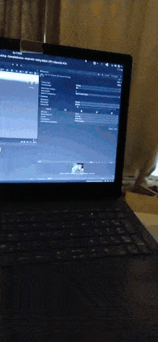

# AR Foundation & Unity 01: Setup for Android 🌞

 

> Since this is my first project with **Unity and Android**, I will encounter a lot of issues with the packages, please check the branches to follow the process

 

- Install this before you continue with **AR FOUNDATION** ✋

 

##### [0 Unity-linux-installation](./0__Unity-linux-installation.md)

##### [1 sdk_dotnet-installation](./1__sdk_dotnet-installation.md)

##### [2\_\_MONO-installation.md](./2__MONO-installation.md)

##### [3\_\_C_compiler-installation](./3__C_compiler-installation.md)

##### [4\_\_integrate-VS-toUnity](./4__integrate-VS-toUnity.md)

##### [5\_\_AR-foundation-intro](./5__AR-foundation-intro.md)

 

#### the project

#### [6\_\_AR-foundation](./6__AR-foundation.md) ✋

 

#### [7\_\_AR-imageTracking](./7__AR-imageTracking.md)

 

#### [8\_\_AR-planeDetection](./8__AR-planeDetection.md)

 
 

---

 
 

## AR
