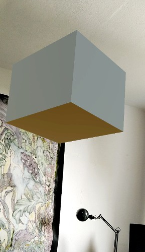
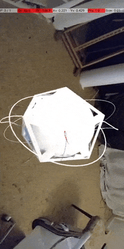

# AR Foundation & Unity 01: Setup for Android 🌞

 

> Since this is my first project with **Unity and Android**, I will encounter a lot of issues with the packages, please check the branches to follow the process

 

- Install this before you continue with **AR FOUNDATION** ✋

 

##### [0 Unity-linux-installation](./0__Unity-linux-installation.md)

##### [1 sdk_dotnet-installation](./1__sdk_dotnet-installation.md)

##### [2\_\_MONO-installation.md](./2__MONO-installation.md)

##### [3\_\_C_compiler-installation](./3__C_compiler-installation.md)

##### [4\_\_integrate-VS-toUnity](./4__integrate-VS-toUnity.md)

##### [5\_\_AR-foundation-intro](./5__AR-foundation-intro.md)

 

#### the project 🌞

#### [6\_\_AR-foundation](./6__AR-foundation.md) ✋

 

#### [7\_\_AR-imageTracking](./7__AR-imageTracking.md)

 

#### [8\_\_AR-planeDetection](./8__AR-planeDetection.md)

 

#### [9\_\_AR-Touch-spiderTest](./9__AR-Touch-spiderTest.md)

 
 

- ✋ Variants with **animated icosphere** [icosphere\_\_spider-Variant](./icosphere__spider-Variant.md)

 
 

---

 
 

## 🍨 [Unity Documentation](https://docs.unity3d.com/Manual/index.html)

 

## AR - learning 🍪

#### [xrbootcamp](https://xrbootcamp.com)

#### [immersive insiders](https://learn.immersive-insiders.com)

> **immersive insiders** We teach you the fundamental programming and design skills, so you become job-ready.

 
 

### Learn Unity C#

##### [Learn Unity - Beginner's Game Development Tutorial](https://youtu.be/gB1F9G0JXOo)

##### [LEARN UNITY - The Most BASIC TUTORIAL I'll Ever Make](https://youtu.be/pwZpJzpE2lQ)

 
 

##### 🌵 [Qu'est-ce qu'un vecteur ? | Essence de l'algèbre linéaire, chapitre 1](https://youtu.be/fNk_zzaMoSs)

##### :ok_hand: scalars [Vectors & Dot Product • Math for Game Devs [Part 1]](https://youtu.be/MOYiVLEnhrw)

##### :ok_hand: [Matrix Multiplication (Math for Game Developers)](https://youtu.be/UG530eh8q4A)
