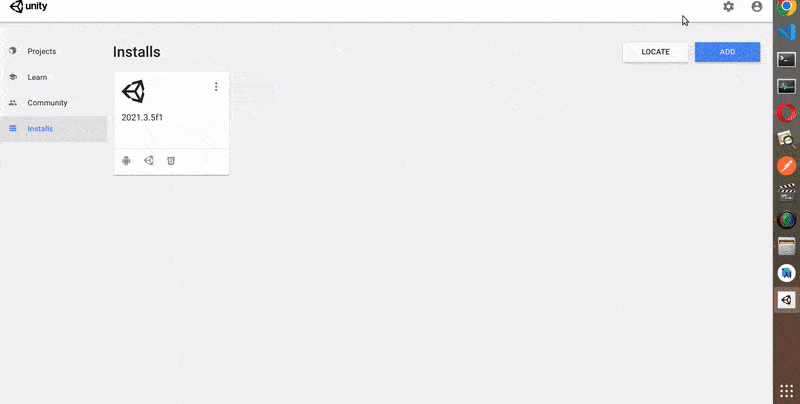

# AR Foundation & Unity 01: Setup for Android 🌞

 
 

- This will be the first chapter of a series of tutorials

<!-- - CRedits: [AR foundation 01: setup for android](https://youtu.be/0mpsiO2lCx0) by **Dinesh Punni** -->

 

#### AR Foundation is a framework purpose-built for augmented reality development that allows you to build rich experiences once, then deploy across multiple mobile and wearable AR devices.

 

#### Visit: [AR Foundation](https://unity.com/unity/features/arfoundation) ✋

 

## Plans and pricing

[Plans and pricing](https://store.unity.com/front-page?check_logged_in=1)

 

 
 

---

 
 

## 01: Setup for Android 🍰

 

Go to unity (in case you dont have it) and download it:

##### [INSTALL UNITY In Less Than 3 MINUTES (Beginner Guide 2022)](https://www.youtube.com/watch?v=5aqCVUt8KY4)

 
 

#### In case you already have it, install the latest ✋

- the **2019.2.0f1** is the one I will be using for this tutorial

 

- Once you choose the version, click next, now choose the packages (this tutorial I will be using **android**) , (**linux Build Support**) and (**WebGL** Build Support)

 

 
 

---

 
 

## Create a project 🍨

 

  

#### Now go to the settings 🌈

##### [Unity documentation](https://docs.unity3d.com/2021.3/Documentation/Manual/class-PlayerSettingsAndroid.html) ✋

 

- **File** > **Build Settings**, once you click on Build settings, a modal will open, choose **android** (once it finish to load), click on **Player settings** (if it doesn't allow you, its because it s not done with loading).

 

 

 

#### Once the Modal opens, check that you are on the <u>Player</u> (in the 'left' column), scroll down:

 

- **1)** Disable **Multithreaded rendering** 🔴 (because android doesn't support it ye)

 

> key for more answers in google: **multithreaded rendering android 2022 unity**

> **What is the need for multithreading?** Multithreading allows the execution of multiple parts of a program at the same time. These parts are known as threads and are lightweight processes available within the process. So multithreading leads to maximum utilization of the CPU by multitasking.

 

> **Is Unity thread safe?**
> Threads are dangerous, so you have to be very careful when synchronizing things back. You also need to remember that Unity API is not thread safe, so all calls to Unity API should be done from the main thread.

 

> **Does Android support multi threaded rendering?**
> When building for Android, the Multithreaded Rendering option is supported in ARCore SDK for Unity 1.17. 0 or later. However, when this option is enabled in Unity 2018.1 and earlier, using the front-facing (selfie) camera is not supported.

 

> **Does unity allow multithreading?** The main thread creates new threads to handle tasks. These new threads run in parallel to one another, and usually synchronize their results with the main thread once completed. This approach to multithreading works well if you have a few tasks that run for a long time.

 

##### Check the explanation: [Multithreaded Rendering in Fortnite: Should You Turn On or Off?](https://youtu.be/w08VNMwL-g8)

 

> If you're playing VALORANT on a high-end device, you may want to turn on Multithreaded Rendering – a video setting that can improve CPU performance and graphics quality on high spec devices (you can get more specifics in these patch notes)

 
 

#### Go under the Vulkan settings:

- **2)** 🔴 to **identification** to be exact, and add a name of your choice (at the moment I have this: com.DefaultCompany.ARFoundation_Android), I will replace it with something like: **com.yourAwesomeCompany.awesomeRainbowTest**

 

 

- 🔴 There is One thing I didnt find in the settings and that you can see He changed in the tutorial (it possible that the version of unity os the reason) but I Will see if it causes issues at the end.

 

- ⚠️ Also.. there are a couple of comments that you should be aware

> For those of you getting a black screen on your phone, go to: edit>project settings>XRPlugin-Management and then check the box for "AR Core". This will fix the black screen. You might also need to enable permissions on your phone.

 

 
 

---

 
 

### Install the packages

- Close the 2 modals, now click on **window** (in the top bar) , there click on **package manager**, another popup will show

 

#### 🔴 The version I had didnt contain the packages he show in his tutorial, so I will download the version <u>201904.40f1</u> just to make this project work, later on I will try an updated version of this

- It took some time to download the lower version, now I have what he has in the video :)

 
 

 

 
