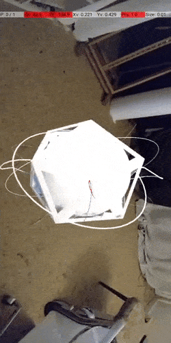

## Exporting blender animations to unity 🌈

 

#### Since the [9\_\_AR-Touch-spiderTest](./9__AR-Touch-spiderTest.md) implementation was a success, I wanted to try something different, with my own models.

 

- **To begin with this new test**, I created a basic shape in blender based on this tutorial [icosphere animation](https://youtu.be/YSzbIWo1UWk),, I think its a good exercise before starting with more complex shapes.

 

- The one I create contains a icosphere and some rings around it, the shape that is animated is the icosphere, so when exporting I only have to choose the mesh

 

### Don't forget to bake the textures ✋

- In this example i didnt bake it but i will try to do it later

 

##### Export in 60secs [FBX Export From Blender to Unity (In 60 Seconds!!!)](https://youtu.be/D-HDrhHgATo))

 

##### Easy rigged [Blender Animation to Unity Tutorial](https://youtu.be/uWexElqDcaA?t=185)

 

##### 1. test

- Here I didnt get the animation correctly(as you can see its not animated), I still dont know if it was due to the exporting or the set up in unity

 

- Here the animation works, so the next step will be to get the textures right

